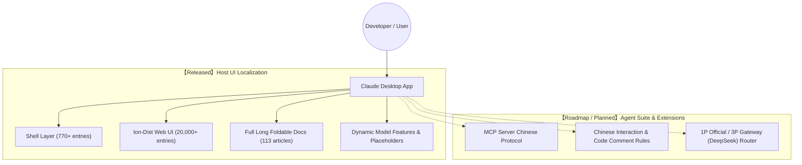
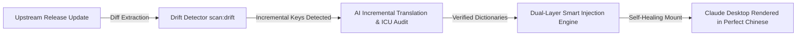

# Claude Chinese Localization Toolkit (claude-chinese)

<p align="center">
  <a href="https://github.com/yiheng8023/claude-chinese/actions/workflows/ci.yml"></a>
  <a href="https://github.com/yiheng8023/claude-chinese/releases/latest"></a>
  <a href="https://github.com/yiheng8023/claude-chinese/releases"></a>
  <a href="https://github.com/yiheng8023/claude-chinese/stargazers"></a>
  <a href="https://github.com/yiheng8023/claude-chinese/network/members"></a>
  
  
  <a href="LICENSE"></a>
</p>

<p align="center">
  <a href="README.md">简体中文</a> | <a href="README.en.md">English</a>
</p>

A high-performance, reversible Chinese localization toolkit designed for Anthropic **Claude Desktop** clients (Windows MSIX / Win32 / macOS / Linux), currently at version **v1.2.66**. Built on official native i18n architectures with incremental overlay, multi-signature topological invariants, and self-healing lifecycle management.

---

## 🌟 Key Features & Design Philosophy

- 🛡️ **Reversible Incremental Overlay & Pure Fallback**: Merges translations dynamically on top of official `en-US` dictionaries while preserving the native English dictionary 100% intact as an ultimate fallback. Any newly introduced upstream keys fall back to English gracefully, completely preventing white-screen crash bugs.
- 🛑 **Agent Suicide Prevention Safety Gate**: Built-in `isProtectedEnvironment()` probe guards against accidental kills when executed inside agent sessions, automated CLI pipelines, or protected environments, preventing crashes of the parent workflow.
- 🧬 **Topology Multi-Signature Invariants & Mutation Fuzzing Matrix**: Replaces brittle regexes with parameter-name-agnostic reverse-reference semantic topology matching, supporting declarative functions, ESBuild arrow functions, and Babel `Object.assign` degraded forms. Fully guarded by state-free `safeTest` regex protections across long documents and UI patches; paired with preflight mutation testing (`npm run test:matrix`) and cloud CI sentinels to verify compatibility before releases reach users.
- 🔄 **Dual-State Pristine Baseline & Anti-Downgrade Self-Healing**: Leverages SHA-256 digests and patch signatures. Confirms clean official `en-US` as authoritative; automatically refreshes baseline backups upon upstream silent updates and enforces atomic rollback circuit breakers during `restore`, preventing stale backups from downgrading newer official releases.
- 🕊️ **Official Chinese Detection & Graceful Yield**: Built-in native multi-language and JavaScript runtime probes. When Anthropic rolls out official native Chinese localization in the future, the toolkit detects it in milliseconds and steps aside gracefully.
- 🎯 **Full HashKey & Deep Long Foldable Documents Coverage**: Over **20,800+** curated core entries and **113 full-length foldable deep documentation guides** (covering Cowork canvas, approval workflows, Claude Code mode, thinking effort dropdowns, and literature reading comparisons).
- 🔒 **Strict ICU AST Syntax Firewall**: Absolute structural validation and protection for dynamic ICU variables (`{count, plural...}`, `{apps}`, `{folderName}`) and technical parameter enumerations (`allow`, `ask`, `low`, `high`, `/loop`), ensuring workflows never stall.
- 🪟 **Least Privilege & MSIX Tailored Adaptation**: Strictly adheres to the principle of least privilege, granting write permissions solely to the current user and avoiding hazardous global Users group ACL escalations.

---

## 🗺️ Architecture & Roadmap



1. **Dimension A: Host UI Localization (Ready & Complete)**:
   - Complete localization of native menus, system tray, Cowork task canvas, approval dialogs, settings, and interactive inputs.
2. **Dimension B: Agent Extension Ecosystem (Roadmap & Evolution)**:
   - **[Planned]** MCP (Model Context Protocol) Chinese workflow integrations;
   - **[Planned]** Adapters for gateway routers such as CC Switch and custom local inference endpoints.

---

## 📋 Prerequisites

1. **Supported Operating Systems**:
   - **Windows**: Windows 10 / 11 (x64) (Supports official MSIX sideloaded packages and standard standalone installations)
   - **macOS**: macOS 12+ (Apple Silicon M-series & Intel chips)
   - **Linux**: Major distributions (Ubuntu, Debian, Fedora, Arch, etc., x64 / ARM64)
2. **Node.js Runtime Environment**:
   - **Node.js (>= 16.x)** with `npm` (Fully compatible with Node 18/20/22/24+ LTS releases).
   - Run `node -v` to verify. If not installed, download the LTS release from [Node.js Official Website](https://nodejs.org/).
3. **Claude Desktop Installed**:
   - Ensure the official Claude Desktop client is installed on your system.

---

## 🚀 Quick Start

### Method 1: One-Click Scripts (Recommended for Daily Use)

#### Windows
- **Install Patch**: Right-click and run [`install.bat`](install.bat) as Administrator
- **Self-Healing Launch**: Double-click [`launch.bat`](launch.bat) (Auto-detects upstream updates, re-patches, and launches)
- **Restore English**: Double-click [`uninstall.bat`](uninstall.bat)

#### macOS / Linux
- **Install Patch**: Run `./install.sh` in terminal
- **Restore English**: Run `./uninstall.sh` in terminal

---

### Method 2: CLI Command Line Manager

```bash
# 1. Check current client and patch status
node cli.js status

# 2. Run comprehensive pre-flight health checks (Node version, client paths, file locks, and ACLs)
node cli.js check

# 3. One-click install (runs pre-flight, safely releases file locks, and mounts overlay)
node cli.js install

# 4. Background watcher & hot-reload daemon (hot reloads on Ctrl+R, auto-repairs on updates)
node cli.js watch

# 5. Self-healing launch (auto-detects version updates, repairs overlay if needed, and launches)
node cli.js launch

# 6. Run upstream drift scan
node cli.js drift

# 7. One-click restore to official English version
node cli.js restore
```

---

## 🧪 Automated Testing & Quality Assurance

The project introduces rigorous end-to-end automated testing, mutation fuzzing, and a cross-platform CI pipeline (Windows / macOS / Ubuntu):

```bash
# Run all core automated test suites (aggregating 4 core suites)
npm test

# Run preflight upstream compatibility matrix and code topology mutation tests
npm run test:matrix

# Run comprehensive localization consistency and ICU terminology audit
npm run audit
```

- **Dictionary Integrity (`test/verify-dict.js`)**: Verifies baseline dictionary syntax, key-value integrity, and format specs (600+ baseline keys, 770+ Chinese keys).
- **ICU Syntax Firewall (`test/test-icu.js`)**: Structural validation and technical term protection across all **20,700+** core entries, ensuring 100% placeholder symmetry.
- **Lifecycle & Anti-Downgrade Verification (`test/test-restore-cycle.js`)**: Tests isolated install -> status assertion -> double-install idempotence -> pristine restoration, plus dedicated circuit breaker assertions preventing silent upstream update overwrites.
- **Cross-Platform Live Detector (`test/test-cross-platform-live.js`)**: Validates 0-argument system path detection and real sandbox injection/restore across Windows, macOS, and Linux runners.
- **Preflight Compatibility Matrix & Mutation Testing (`tools/upstream-compatibility-matrix.js` / `npm run test:matrix`)**: Simulates extreme bundler minification mutations (variable renaming, arrow functions, Object.assign fallbacks), asserting code topology resilience before upstream releases reach users.
- **Ultimate Localization Consistency Audit (`tools/ultimate-consistency-audit.js` / `npm run audit`)**: Comprehensive audit of thinking efforts, approval workflows, action verbs, 0 HTML tag discrepancies, and 0 ICU variable mismatches.

---

## 🔄 Self-Evolving Pipeline



---

## 📁 Repository Structure

```text
claude-chinese/
├── .github/
│   └── workflows/
│       ├── ci.yml                    # Cross-platform (Windows/macOS/Linux) CI test pipeline
│       └── upstream-matrix-sentinel.yml # Preflight compatibility & mutation fuzzing daily sentinel
├── dict/                             # Core Chinese dictionaries
│   ├── zh-CN.json                    # Shell layer translation dictionary (820+ entries)
│   ├── ion-zh-CN.json                # Web/Ion core UI dictionary (20,000+ entries)
│   ├── long-docs-zh-CN.json          # Full foldable deep documentation guides (113 articles)
│   └── dynamic-zh-CN.json            # Dynamic features & reasoning placeholders dictionary
├── core/                             # Core injection & architecture engine
│   ├── patcher.js                    # Multi-signature long docs engine, JS whitelist & baseline healing
│   ├── msix-detector.js              # MSIX container detector & cross-platform layout resolver
│   ├── permissions.js                # Windows ACL security permissions and elevation utility
│   └── preflight.js                  # Comprehensive environment health checker (Node/Client/Locks)
├── test/                             # Automated regression test suites
│   ├── verify-dict.js                # Dictionary syntax and integrity assertions
│   ├── test-icu.js                   # 20,800+ entries ICU placeholder and terminology protection
│   ├── test-restore-cycle.js         # Install/restore lifecycle & silent update anti-downgrade assertions
│   └── test-cross-platform-live.js   # 0-argument path detection & sandbox injection tests
├── tools/                            # Automation engineering and compatibility toolchains
│   ├── upstream-compatibility-matrix.js # Preflight multi-version compatibility matrix & mutation fuzzer
│   ├── drift-detector.js             # Upstream text diff extraction & drift detector (scan:drift)
│   ├── comprehensive-audit.js        # Full-dimension localization quality & technical enum audit (audit)
│   ├── ultimate-consistency-audit.js # Global terminology, ICU variables & HTML symmetry deep audit
│   └── compile-zh-dict.js            # Baseline incremental merge & dictionary compilation tool
├── docs/assets/sponsoring/           # Sponsorship & community assets
├── cli.js                            # Cross-platform CLI lifecycle entry point
├── install.bat / install.sh          # One-click installation scripts
├── launch.bat                        # Self-healing launcher script
├── uninstall.bat / uninstall.sh      # One-click restore scripts
├── package.json                      # Project configuration & npm scripts
├── LICENSE                           # MIT License
└── README.md / README.en.md          # Bilingual documentation
```

---

## 💖 Voluntary Sponsoring & Support

If the Claude Chinese Localization Toolkit has benefited your work and daily development, and you would like to support ongoing maintenance, documentation improvements, automated testing, and version updates, voluntary donations of any amount are deeply appreciated. Sponsorship is entirely voluntary and does not constitute any service-level agreement.

- **RMB Sponsorship**: Scan the WeChat Pay or Alipay QR codes below.
- **Cross-Border / Other Currencies**: Use our **[PayPal Sponsoring Link](https://www.paypal.com/ncp/payment/LNTF8KXGJXMZY)**. Accepted currencies, payment methods, and exchange rates are subject to PayPal's checkout page.

Please verify the payee name shown on the checkout page before confirming payment. Thank you for your support of open-source software!

<table>
  <tr>
    <td align="center"><strong>WeChat Pay (RMB)</strong><br></td>
    <td align="center"><strong>Alipay (RMB)</strong><br></td>
  </tr>
</table>

---

## 👥 Contributors

Heartfelt thanks to all developers who contribute code, report bugs, and improve translations and documentation!

<p align="center">
  <a href="https://github.com/yiheng8023/claude-chinese/graphs/contributors">
    
  </a>
</p>

---

## 📈 Star History & Community Growth

[](https://star-history.com/#yiheng8023/claude-chinese&Date)

---

## ⚠️ Disclaimer & Compliance

1. **Non-Official Project**: This project is an independent open-source localization utility developed by the open-source community. It is **NOT** an official product of Anthropic, PBC and is neither affiliated with nor endorsed by Anthropic, PBC or its subsidiaries.
2. **Trademark Notice**: `Claude`, `Anthropic`, `DeepSeek`, and related trademarks, product names, and copyrights are the property of their respective owners.
3. **Authorized Personal Use**: This toolkit is provided solely for personal learning, technical research, and Chinese localization assistance. This project **DOES NOT** distribute any proprietary binary assets; all patching operations are executed locally on the user's client machine.
4. **Security & Privacy**: This project contains **ZERO** telemetry reporting, network backdoors, or credential extraction mechanisms. All source code is 100% transparent and auditable.

---

## 📄 License

This project is licensed under the [MIT License](LICENSE).
