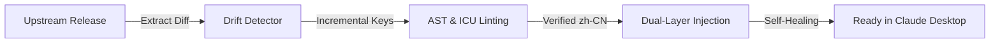

# Claude Chinese Localization Toolkit (claude-chinese)

<p align="center">
  <a href="README.md">简体中文</a> | <a href="README.en.md">English</a>
</p>

> 🚀 **High-performance, Non-invasive, Self-healing Chinese Localization Toolkit for Anthropic Claude Desktop clients (Windows MSIX / Win32 / macOS / Linux).**

A robust, industrial-grade localization engine tailored for **Claude Desktop**, fully aligned with the **`antigravity-chinese`** architectural principles. Built to survive frequent upstream updates, Windows MSIX ACL restrictions, and customized third-party routing (e.g., **CC Switch + DeepSeek** in `cowork + code` hybrid modes).

---

## 🌟 Core Highlights & Architectural Philosophy

- 🛡️ **Non-invasive Dual-layer Injection**: Hooks directly into official i18n JSON resources (`Shell` + `Ion-Dist Web UI`) and JS language registries without binary decompilation or ASAR corruption.
- 🧬 **Self-healing & Drift-resistant**: Equipped with upstream drift detectors (`npm run scan:drift`) that monitor, diff, and auto-align with upstream updates in seconds.
- 🎯 **100% HashKey & UI Coverage**: Over 18,900+ curated translations covering Cowork canvases, manual/auto approval flows, Claude Code, model selectors, and settings.
- 🔒 **Strict ICU AST Syntax Firewall**: Absolute protection for dynamic ICU variables (`{count, plural...}`, `{apps}`, `{folderName}`) and technical specs (`1M`, `128k`, `MCP`, `API`, `OAuth`), ensuring task workflows never freeze.
- 🪟 **MSIX & WindowsApps Specialized Adapter**: Built-in automated UAC elevation and ACL management for sideloaded Windows AppX packages.

---

## 📋 Prerequisites

1. **Operating System**: Windows 10/11 (x64), macOS (Apple Silicon / Intel), Linux.
2. **Node.js**: >= 16.x (with npm).
3. **Claude Desktop**: Official desktop client installed.

---

## 🚀 Quick Start

### Option 1: One-Click Script (Recommended)

#### Windows
* **Install**: Right-click [`install.bat`](install.bat) and choose "Run as administrator".
* **Self-Healing Launch**: Double-click [`launch.bat`](launch.bat).
* **Restore English**: Double-click [`uninstall.bat`](uninstall.bat).

#### macOS / Linux
* **Install**: Run `./install.sh`
* **Restore English**: Run `./uninstall.sh`

---

### Option 2: CLI Manager

```bash
# Check client and patch health status
node cli.js status

# Install full localization patch
node cli.js install

# Restore official English
node cli.js restore

# Launch with self-healing check
node cli.js launch

# Upstream drift detection scan
node cli.js drift
```

---

## 🧪 Testing & Verification

```bash
# Run full automated regression & ICU firewall assertions
npm test

# Run comprehensive dictionary audit
node tools/comprehensive-audit.js
```

---

## 🔄 Self-Evolving Localization Workflow



---

## 📄 License

This project is licensed under the [MIT License](LICENSE).
