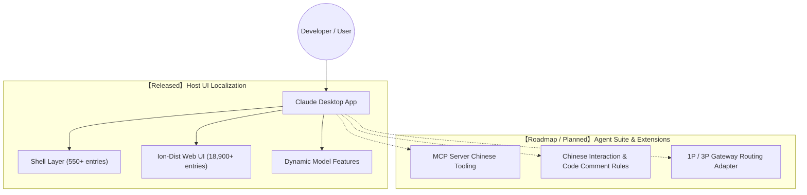

# Claude Chinese Localization Toolkit (claude-chinese)

<p align="center">
  <a href="https://github.com/yiheng8023/claude-chinese/actions/workflows/ci.yml"></a>
  <a href="https://github.com/yiheng8023/claude-chinese/releases/latest"></a>
  <a href="https://github.com/yiheng8023/claude-chinese/releases"></a>
  <a href="https://github.com/yiheng8023/claude-chinese/stargazers"></a>
  <a href="https://github.com/yiheng8023/claude-chinese/network/members"></a>
  
  
  <a href="LICENSE"></a>
</p>

<p align="center">
  <a href="README.md">简体中文</a> | <a href="README.en.md">English</a>
</p>

High-performance, reversible Chinese localization toolkit designed for Anthropic **Claude Desktop** clients (Windows MSIX / Win32 / macOS / Linux). Built on official native i18n architectures with incremental overlay and self-healing lifecycle management.

---

## 🌟 Core Features & Design Philosophy

- 🛡️ **Reversible Incremental Overlay & Pure Fallback**: Merges translations on top of official `en-US` dictionaries while preserving the native English dictionary 100% intact as an ultimate fallback. Upstream unknown keys fall back to English gracefully.
- 🕊️ **Official Chinese Detection & Graceful Yield**: Automatically detects when Anthropic officially rolls out native Chinese localization packages and yields gracefully.
- 🧬 **Self-Healing & Drift-Resistant**: Equipped with upstream drift detectors (`npm run scan:drift`) that monitor, diff, and auto-align with upstream updates in seconds.
- 🎯 **Full HashKey & UI Coverage**: Over 18,500+ curated translations covering Cowork canvases, approval flows, Claude Code, model selectors, and settings.
- 🔒 **Strict ICU AST Syntax Firewall**: Absolute protection for dynamic ICU variables (`{count, plural...}`, `{apps}`, `{folderName}`) and technical parameters (`1M`, `128k`, `MCP`, `DeepSeek`), ensuring task workflows never freeze.
- 🪟 **Least Privilege & MSIX Adaptation**: Strictly adheres to the least-privilege security principle, granting necessary write permissions solely to the current user.

---

## 🗺️ Architecture & Roadmap



1. **Dimension A: Host UI Localization (Ready)**:
   - Full localization of native menus, system tray, Cowork task canvas, approval dialogs, settings, and inputs.
2. **Dimension B: Agent Extension Ecosystem (Roadmap / Planned)**:
   - **[Planned]** MCP (Model Context Protocol) Chinese workflow integrations.
   - **[Planned]** Adapters for gateway routers such as CC Switch and local inference endpoints.

---

## 📋 Prerequisites

1. **Supported Operating Systems**:
   - **Windows**: Windows 10 / 11 (x64) (Supports official MSIX and standard versions)
   - **macOS**: macOS 12+ (Apple Silicon M-series & Intel)
   - **Linux**: Major distributions (x64 / ARM64)
2. **Node.js Runtime**:
   - **Node.js (>= 16.x)** with `npm` (Fully compatible with Node 18/20/22/24+).
3. **Claude Desktop**:
   - Official Claude Desktop client installed.

---

## 🚀 Quick Start

### Method 1: One-Click Scripts (Recommended)

#### Windows
- **Install Patch**: Double-click [`install.bat`](install.bat)
- **Self-Healing Launch**: Double-click [`launch.bat`](launch.bat)
- **Restore English**: Double-click [`uninstall.bat`](uninstall.bat)

#### macOS / Linux
- **Install Patch**: Run `./install.sh`
- **Restore English**: Run `./uninstall.sh`

---

### Method 2: CLI Command Line Manager

```bash
# 1. Check current client and patch status
node cli.js status

# 2. Run comprehensive pre-flight health checks
node cli.js check

# 3. One-click install (runs pre-flight, releases file locks, and mounts overlay)
node cli.js install

# 4. Background watcher daemon mode (hot-reloads translations and auto-repairs on updates)
node cli.js watch

# 5. Self-healing launch
node cli.js launch

# 6. Run upstream drift scan
node cli.js drift

# 7. One-click restore to official English version
node cli.js restore
```

---

## 🧪 Automated Testing & CI Verification

```bash
# Run all 4 automated test suites
npm test
```

- **Dictionary Integrity (`test/verify-dict.js`)**: Verifies baseline dictionary syntax and coverage.
- **ICU Syntax Firewall (`test/test-icu.js`)**: Protects placeholders, variables, and technical terms.
- **Lifecycle & Atomic Rollback (`test/test-restore-cycle.js`)**: Tests isolated install -> restore -> double-install lifecycle in sandbox fixtures.
- **Cross-Platform Live Detector (`test/test-cross-platform-live.js`)**: Tests 0-argument path discovery and multi-platform layouts.

---

## 👥 Contributors

Heartfelt thanks to all developers who contribute code, report bugs, and improve translations and documentation!

<p align="center">
  <a href="https://github.com/yiheng8023/claude-chinese/graphs/contributors">
    
  </a>
</p>

---

## 📈 Star History & Community Growth

[](https://star-history.com/#yiheng8023/claude-chinese&yiheng8023/antigravity-chinese&Date)

---

## ⚠️ Disclaimer & Compliance

1. **Non-Official Project**: This project is an independent open-source localization utility developed by the open-source community. It is **NOT** an official product of Anthropic, PBC and is neither affiliated with nor endorsed by Anthropic, PBC or its subsidiaries.
2. **Trademark Notice**: `Claude`, `Anthropic`, `DeepSeek`, and related trademarks, product names, and copyrights are the property of their respective owners.
3. **Authorized Personal Use**: This toolkit is provided solely for personal learning, technical research, and Chinese localization assistance. This project **DOES NOT** distribute any proprietary binary assets; all patching operations are executed locally on the user's client machine.
4. **Security & Privacy**: This project contains **ZERO** telemetry reporting, network backdoors, or credential extraction mechanisms. All source code is 100% transparent and auditable.

---

## 📄 License

This project is licensed under the [MIT License](LICENSE).
