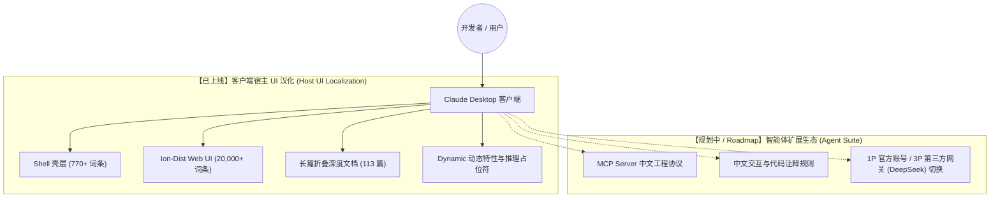

# Claude 桌面端自愈型中文汉化工具包 (Claude Chinese Toolkit)

<p align="center">
  <a href="https://github.com/yiheng8023/claude-chinese/actions/workflows/ci.yml"></a>
  <a href="https://github.com/yiheng8023/claude-chinese/releases/latest"></a>
  <a href="https://github.com/yiheng8023/claude-chinese/releases"></a>
  <a href="https://github.com/yiheng8023/claude-chinese/stargazers"></a>
  <a href="https://github.com/yiheng8023/claude-chinese/network/members"></a>
  
  
  <a href="LICENSE"></a>
</p>

<p align="center">
  <a href="README.md">简体中文</a> | <a href="README.en.md">English</a>
</p>


专为 Anthropic **Claude Desktop** 桌面客户端（Windows MSIX / Win32 / macOS / Linux）打造的高性能、可逆式中文本地化工具包（当前版本 **v1.2.58**）。基于官方原生 i18n 架构打造增量挂载与自愈工程体系，实现全量 UI 界面汉化与版本更新自动自愈。

---

## 🌟 核心特性与设计哲学

- 🛡️ **可逆式增量挂载与纯净兜底 (Incremental Overlay & Fallback)**：基于官方原版 `en-US` 进行增量合并，**绝不粗暴覆盖原版英文字典**。当官方更新引入全新词条时自动回退英文，彻底拆除“更新即白屏”的隐患。
- 🧬 **拓扑多签名引擎与事前混淆变异矩阵 (Topology Invariants & Mutation Matrix)**：创新引入参数名无关的拓扑反向引用与声明式/箭头/Object.assign 三签名自适应拦截器，搭配事前混淆变异碰撞测试工具（`npm run test:matrix`）与云端事前哨兵 CI，在上游发版前完成兼容性闭环验证。
- 🔄 **双重状态感知出厂基线与版本防回退 (Dual-State Pristine Baseline & Anti-Downgrade)**：基于 SHA-1 清单与注入特征双判据。官方静默发版更新时自动刷新备份基准，还原时自动熔断拦截，彻底消除了陈旧备份覆盖官方更新导致的版本回退隐患。
- 🕊️ **官方中文自动检测与优雅让位 (Graceful Yield)**：内置官方多语言与原生 JS 白名单自动嗅探，当 Anthropic 官方未来原生支持中文时，工具包将秒级识别并自动优雅让位。
- 🎯 **全量 HashKey 界面与长篇折叠文档覆盖**：覆盖全量 20,700+ 核心词条与 113 篇全景折叠长文档（包含 Cowork 协同画布、权限审批流、Claude Code 模式、思考强度下拉与名著阅读对比）。
- 🔒 **严格的 ICU 语法与 AST 变量防火墙**：严格防护 `{count, plural...}`, `{apps}`, `{folderName}` 等变量插值与底层配置枚举（如 `allow`, `ask`, `low`, `high`, `/loop` 等），确保任务流与配置执行永不卡死。
- 🪟 **最小特权原则与 MSIX 专属适配**：严格遵循安全边界，仅对当前用户赋予必要文件修改权限，杜绝全局 Users 组高危赋权。

---

## 🗺️ 架构与演进路线图 (Architecture & Roadmap)

本项目采用分阶段演进架构：



1. **维度 A：客户端宿主全量本地化 (Host UI Localization - 已就绪)**：
   - 彻底汉化客户端所有原生菜单、系统托盘、Cowork 协同任务画布、审批流弹窗、设置与输入交互。
2. **维度 B：智能体扩展生态 (MCP Agent Suite - 规划演进中)**：
   - **[计划]** 通过官方 **MCP (Model Context Protocol)** 协议接入中文工具链与本地工作流；
   - **[计划]** 适配 **CC Switch** 等路由网关，支持在官方 Claude 与第三方推理端点之间无缝切换。

---

## 📋 前置环境与要求 (Prerequisites)

1. **操作系统支持**：
   - **Windows**：Windows 10 / 11 (x64)（支持官方 MSIX 旁加载版与标准版）
   - **macOS**：macOS 12+（Apple Silicon M 系列及 Intel 芯片）
   - **Linux**：主流发行版（x64 / ARM64）
2. **Node.js 基础运行环境**：
   - 系统中需安装 **Node.js (>= 16.x)** 及附带的 **npm**。
   - 验证方式：在终端运行 `node -v`。若未安装，请前往 [Node.js 官方网站](https://nodejs.org/) 下载安装 LTS 版本。
3. **已安装 Claude Desktop 客户端**：
   - 确保本机已安装官方 Claude 桌面客户端。

---

## 🚀 快速开始

### 方式一：一键脚本（推荐日常使用）

#### Windows
* **一键安装**：右键以管理员身份运行 [`install.bat`](install.bat)
* **自愈启动**：双击运行 [`launch.bat`](launch.bat)（自动检测版本覆盖并重新注入后启动）
* **恢复英文**：双击运行 [`uninstall.bat`](uninstall.bat)

#### macOS / Linux
* **一键安装**：在终端运行 `./install.sh`
* **恢复英文**：在终端运行 `./uninstall.sh`

---

### 方式二：CLI 命令行管理器

```bash
# 1. 查看当前客户端及汉化状态
node cli.js status

# 2. 执行前置环境全维健康预检 (Node 弹性版本、客户端安装、进程锁定与权限)
node cli.js check

# 3. 一键安装汉化（自动执行前置预检、安全释放文件锁并完成增量挂载）
node cli.js install

# 4. 启动热重载与自愈守护进程 (编辑词库后按 Ctrl+R 秒级生效，官方更新自动自愈)
node cli.js watch

# 5. 自愈启动（自动检测版本覆盖并在需要时秒级自愈挂载后拉起客户端）
node cli.js launch

# 6. 执行上游版本文本漂移分析 (Drift Detection)
node cli.js drift

# 7. 一键还原回官方英文原版
node cli.js restore
```

---

## 🧪 自动化测试与质量保证 (Testing & Verification)

本项目引入严格的端到端自动化测试与跨平台 CI 流水线（Windows / macOS / Ubuntu），避免人工经验验证带来的遗漏：

```bash
# 运行全套自动化测试套件（聚合 4 大核心测试套件）
npm test

# 运行事前上游兼容矩阵与混淆变异碰撞模糊测试
npm run test:matrix

# 运行全维度本地化一致性与 ICU 专有名词审计
npm run audit
```

- **核心字典完整性 (`test/verify-dict.js`)**：验证基础字典结构无缺失、无空值。
- **ICU 语法防火墙 (`test/test-icu.js`)**：确保所有模板变量、复数分支与技术专有名词 100% 结构对称。
- **生命周期还原闭环 (`test/test-restore-cycle.js`)**：验证真实安装 -> 状态判定 -> 干净还原 -> 原版回退全流程，包含官方静默升级防版本回退专项断言。
- **跨平台宿主无参探测与沙盒实测 (`test/test-cross-platform-live.js`)**：在真实 Ubuntu / macOS / Windows runner 上验证 0 参数路径探测与跨平台布局注入。
- **事前兼容矩阵与混淆变异碰撞 (`tools/upstream-compatibility-matrix.js`)**：模拟打包混淆变异（变量置换、箭头函数、Object.assign 降级），在代码发布前完成韧性压力断言。

---

## 🔄 自动化演进闭环 (Self-Evolving Pipeline)


---

## 📁 仓库结构 (Repository Structure)

```text
claude-chinese/
├── .github/
│   └── workflows/
│       ├── ci.yml                    # 全平台 (Windows/macOS/Linux) CI 自动化测试流水线
│       └── upstream-matrix-sentinel.yml # 上游事前兼容矩阵与混淆变异碰撞每日巡检哨兵
├── dict/                             # 核心汉化词库
│   ├── zh-CN.json                    # Shell 壳层汉化词典 (770+ 词条)
│   ├── ion-zh-CN.json                # Web/Ion 核心 UI 词典 (20,000+ 词条)
│   ├── long-docs-zh-CN.json          # 全景折叠长文档与企业级深度说明词典 (113 篇)
│   └── dynamic-zh-CN.json            # 动态特性与推理占位符词典
├── core/                             # 核心注入与架构引擎
│   ├── patcher.js                    # 拓扑多签名长文档引擎、JS 白名单与出厂基线自愈
│   ├── msix-detector.js              # MSIX 容器探测与跨平台多布局解析
│   ├── permissions.js                # Windows ACL 权限安全授予与提权工具
│   └── preflight.js                  # 前置环境全维健康预检器 (Node/客户端/进程锁)
├── test/                             # 自动化全真回归测试套件
│   ├── verify-dict.js                # 字典语法与完整性断言
│   ├── test-icu.js                   # 全量 20,700+ 词条 ICU 占位符与专有名词保护断言
│   ├── test-restore-cycle.js         # 安装、还原生命周期与官方静默升级防降级断言
│   └── test-cross-platform-live.js   # 跨平台无参系统路径探测与沙盒注入实测
├── tools/                            # 自动化工程与事前兼容工具链
│   ├── upstream-compatibility-matrix.js # 上游多版本事前兼容矩阵与混淆变异碰撞测试引擎
│   ├── drift-detector.js             # 上游版本文本差量提取与漂移检测器 (scan:drift)
│   ├── comprehensive-audit.js        # 全维度本地化质量与技术枚举保护审计 (audit)
│   ├── ultimate-consistency-audit.js # 全局术语、ICU 变量与 HTML 对称性深度体检
│   └── compile-zh-dict.js            # 官方原版基准增量合并与编译工具
├── docs/assets/sponsoring/           # 赞助与社区资产
├── cli.js                            # 跨平台生命周期命令行管理入口
├── install.bat / install.sh          # 一键安装脚本
├── launch.bat                        # 自愈启动脚本
├── uninstall.bat / uninstall.sh      # 一键还原脚本
├── package.json                      # 项目配置与 npm scripts
├── LICENSE                           # MIT 开源许可证
└── README.md / README.en.md          # 中英双语说明文档
```

---

## 💖 自愿赞助与支持

如果 Claude 中文汉化项目对你的工作与日常开发有所帮助，并且你愿意支持本项目的持续维护、文档优化、自动化测试与版本迭代，诚挚感谢任意金额的自愿赞助。赞助完全自愿，不构成任何服务级承诺。

- **人民币赞助**：可扫描下方微信支付或支付宝收款码。
- **跨境赞助 / 其他币种**：可以使用 **[PayPal 赞助链接](https://www.paypal.com/ncp/payment/LNTF8KXGJXMZY)**。实际可用币种、付款方式与换汇以 PayPal 结算页为准。

付款前请核对结算页面显示的收款方。感谢你对开源项目的认可与支持！

<table>
  <tr>
    <td align="center"><strong>微信支付（人民币）</strong><br></td>
    <td align="center"><strong>支付宝（人民币）</strong><br></td>
  </tr>
</table>

---

## 👥 贡献者墙 (Contributors)

诚挚感谢所有为本项目贡献代码、反馈 Bug、完善词库与文档的开发者们！

<p align="center">
  <a href="https://github.com/yiheng8023/claude-chinese/graphs/contributors">
    
  </a>
</p>

---

## 📈 Star 增长趋势与社区生态 (Star History)

[](https://star-history.com/#yiheng8023/claude-chinese&Date)

---

## ⚠️ 免责声明与合规说明 (Disclaimer & Compliance)

1. **非官方项目**：本项目为社区发起的开源本地化辅助工具，**非 Anthropic 官方产品**，与 Anthropic, PBC 及其关联公司无官方从属或背书关系。
2. **商标声明**：`Claude`, `Anthropic`, `DeepSeek` 等相关商标、产品名称及版权均归其各自所有者所有。
3. **合法使用**：本项目仅供个人学习、技术研究及中文本地化辅助使用。本项目**绝不分发**任何官方专有二进制资产，所有修改均在用户本地客户端合法完成。
4. **安全与隐私**：本项目**绝不包含**任何形式的遥测上报、网络后门或用户凭据读取逻辑。代码 100% 开源透明。

---

## 📄 开源协议

本项目基于 [MIT License](LICENSE) 协议开源。
