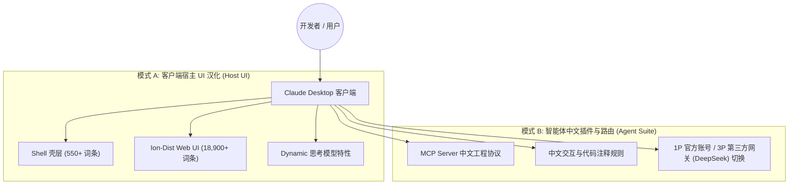

# Claude 桌面端自愈型中文汉化工具包 (Claude Chinese Toolkit)

<p align="center">
  <a href="README.md">简体中文</a> | <a href="README.en.md">English</a>
</p>

专为 Anthropic **Claude Desktop** 桌面客户端（Windows MSIX / Win32 / macOS / Linux）打造的高性能、非侵入式中文本地化工具包。具备工业级自愈工程体系，完美解决官方版本频繁更新、MSIX 权限封锁、动态占位符破损以及第三方模型路由（如 **CC Switch + DeepSeek** 等在 `cowork + code` 混合模式下）的汉化与自愈需求。

---

## 🌟 核心特性与设计哲学

- 🛡️ **非侵入式双层注入 (Non-invasive Dual-Layer)**：无需对主程序核心二进制进行暴力开膛，直接基于官方 i18n 资源体系（`Shell 壳层` + `Ion-Dist Web UI`）与前端 JS 语言白名单进行无损挂载。
- 🧬 **自愈与抗漂移 (Self-Healing & Drift-Resistant)**：内置版本漂移检测引擎 (`npm run scan:drift`)，官方发版更新后秒级检测新增与废弃词条，彻底终结更新后满世界找新补丁的痛点。
- 🎯 **全量 HashKey 界面覆盖**：覆盖全量 18,900+ 核心词条（包含完整的 Cowork 协同画布、权限审批流、Claude Code 模式、模型规格选择器与设置面板）。
- 🔒 **严格的 ICU 语法与 AST 变量防火墙**：严格防护 `{count, plural...}`, `{apps}`, `{folderName}` 等变量插值与规格参数（如 `1M`, `128k`, `MCP`, `DeepSeek` 等），确保任务流执行永不卡死。
- 🪟 **MSIX / WindowsApps 专属适配**：深度适配 Windows MSIX 旁加载版本，提供自动提权夺权注入与静默自愈启动器。

---

## 🔌 双模生态：UI 本地化 + 智能体增强 (Dual-Mode Architecture)

本项目不仅仅是一个单纯的界面补丁，更提供两套协同运行的本地化维度（宿主界面全量汉化 + 智能体协议增强）：



1. **模式 A：宿主界面全量本地化 (Host UI Localization)**：
   - 彻底汉化客户端所有原生菜单、系统托盘、Cowork 协同任务看板、审批流弹窗、设置与输入交互。
2. **模式 B：智能体插件与协议增强 (MCP Agent Suite)**：
   - 支持通过官方 **MCP (Model Context Protocol)** 协议接入中文工具链与本地工作流；
   - 完美适配 **CC Switch** 等路由网关，自由在官方 Claude 与各类第三方前沿大模型（如 DeepSeek 全系列、本地与云端推理端点）之间无缝切换。

---

## 📋 前置环境与要求 (Prerequisites)

1. **操作系统支持**：
   - **Windows**：Windows 10 / 11 (x64)（支持官方 MSIX 旁加载版与标准版）
   - **macOS**：macOS 12+（Apple Silicon M 系列及 Intel 芯片）
   - **Linux**：主流发行版（x64 / ARM64）
2. **Node.js 基础运行环境**：
   - 系统中需安装 **Node.js (>= 16.x)** 及附带的 **npm**。
   - 验证方式：在终端运行 `node -v`。若未安装，请前往 [Node.js 官方网站](https://nodejs.org/) 下载安装 LTS 版本。
3. **已安装 Claude Desktop 客户端**：
   - 确保本机已安装官方 Claude 桌面客户端。

---

## 🚀 快速开始

### 方式一：一键脚本（推荐日常使用）

#### Windows
* **一键安装**：右键以管理员身份运行 [`install.bat`](install.bat)
* **自愈启动**：双击运行 [`launch.bat`](launch.bat)（自动检测版本覆盖并重新注入后启动）
* **恢复英文**：双击运行 [`uninstall.bat`](uninstall.bat)

#### macOS / Linux
* **一键安装**：在终端运行 `./install.sh`
* **恢复英文**：在终端运行 `./uninstall.sh`

---

### 方式二：CLI 命令行管理器

```bash
# 1. 查看当前客户端及汉化状态
node cli.js status

# 2. 一键安装汉化（自动备份并完成双层注入与 JS 注册）
node cli.js install

# 3. 自愈启动（自动检测版本覆盖并在需要时秒级自愈挂载）
node cli.js launch

# 4. 执行上游版本文本漂移分析 (Drift Detection)
node cli.js drift

# 5. 一键还原回官方英文原版
node cli.js restore
```

---

## 🧪 自动化测试与质量保证 (Testing & Verification)

本项目引入严格的端到端自动化测试与全维度质量审计：

```bash
# 运行核心字典完整性与 ICU 防火墙测试
npm test

# 运行全维度一致性与质量审计工具
node tools/comprehensive-audit.js

# 运行上游版本漂移检测
npm run scan:drift
```

* **字典完整性断言 (`test/verify-dict.js`)**：验证核心字典结构无缺失、无空值。
* **ICU 语法防火墙 (`test/test-icu.js`)**：确保所有模板变量、复数分支与技术专有名词 100% 结构对称。
* **全维度质量审计 (`tools/comprehensive-audit.js`)**：自动扫描 HTML 标签闭合性、上下文规格（如 `1M` 保护）与专有名词一致性。

---

## 🔄 自动化演进闭环 (Self-Evolving Pipeline)


---

## 💖 自愿赞助与支持

如果 Claude 中文汉化项目对你的工作与日常开发有所帮助，并且你愿意支持本项目的持续维护、文档优化、自动化测试与版本迭代，诚挚感谢任意金额的自愿赞助。赞助完全自愿，不构成任何服务级承诺。

- **人民币赞助**：可扫描下方微信支付或支付宝收款码。
- **跨境赞助 / 其他币种**：可以使用 **[PayPal 赞助链接](https://www.paypal.com/ncp/payment/LNTF8KXGJXMZY)**。实际可用币种、付款方式与换汇以 PayPal 结算页为准。

付款前请核对结算页面显示的收款方。感谢你对开源项目的认可与支持！

<table>
  <tr>
    <td align="center"><strong>微信支付（人民币）</strong><br></td>
    <td align="center"><strong>支付宝（人民币）</strong><br></td>
  </tr>
</table>

---

## ⚠️ 免责声明与合规说明 (Disclaimer & Compliance)

1. **非官方项目**：本项目为社区发起的开源本地化辅助工具，**非 Anthropic 官方产品**，与 Anthropic, PBC 及其关联公司无官方从属或背书关系。
2. **商标声明**：`Claude`, `Anthropic`, `DeepSeek` 等相关商标、产品名称及版权均归其各自所有者所有。
3. **合法使用**：本项目仅供个人学习、技术研究及中文本地化辅助使用。本项目**绝不分发**任何官方专有二进制资产，所有修改均在用户本地客户端合法完成。
4. **安全与隐私**：本项目**绝不包含**任何形式的遥测上报、网络后门或用户凭据读取逻辑。代码 100% 开源透明。

---

## 📄 开源协议

本项目基于 [MIT License](LICENSE) 协议开源。
